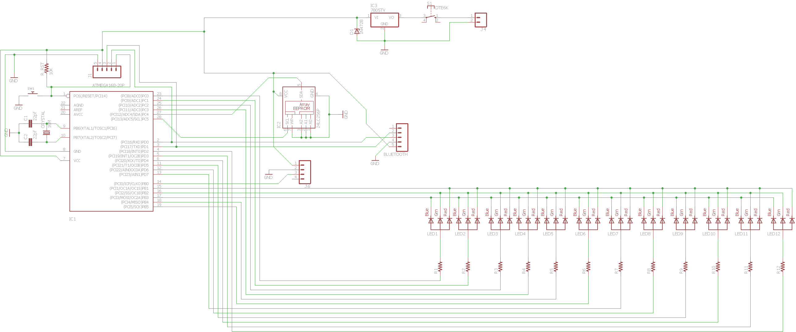

# Persistance of Vision
Persistence of Vision or POV is based on human vision capability. It works using the fact that human eye is unable to detect change within 1/16 sec. LEDs were mounted on flat strip of PCB attached with stepper motor. Further on basis of coding, different effects could be observed while rotating.

## Delay Calculation
It is important to set delay of Leds on and off time to clearly visulize the characters while rotating. So for calculating delay, following strategy was used as shown in figure.

*Formula to calculate delay*

## Character Combination for 5 and 12 Leds Strip

To generate different charater combination, Every led step is counted as binary number. Suppose to display one digit as straight verticle line on 5 leds, we have to turn on all leds at same time. So the arrary values will be like: 1+2+4+8+16 = 31. So 31 will be stored in array to display a straight line. This technique is followed for each character to create array. See Example figure below to have some graphical overview.

*Technique to calculate array combination*

## PCB Schematic and Board file Snapshots
The Schematic and PCB file was designed using Eagle CAD Software. 

## Componenets
* Atmel's Atmega 168-20P
* Stepper Motor
* Lipo Battery
* Electronic Speed Control (ESC)
* HC-05 Bluetooth Sensor
* Transistors, Volaatge Regulator
* RGB Leds, Resistors, Capacitors

### Acknowledgement
This project was completed during my internship at [FAB LAB Sukkur IBA University](http://fablab.iba-suk.edu.pk/) in 2017. I am thankful to Engr. Dr. Muhammad Asim Ali Samejo and Fab Lab instructor Engr. Manzar Hussain Laghari for their guidance.
